# Корпоративная система управления инцидентами (IMS)
## Полное описание архитектуры и функционала

**Версия документации:** 1.0  
**Дата актуализации:** 2025

---

## СОДЕРЖАНИЕ

1. [Обзор системы](#1-обзор-системы)
2. [Архитектура системы](#2-архитектура-системы)
3. [База данных](#3-база-данных)
4. [Backend сервисы](#4-backend-сервисы)
5. [Frontend приложение](#5-frontend-приложение)
6. [Авторизация и пользователи](#6-авторизация-и-пользователи)
7. [Управление инцидентами](#7-управление-инцидентами)
8. [SLA и эскалация](#8-sla-и-эскалация)
9. [Уведомления](#9-уведомления)
10. [Дашборд и статистика](#10-дашборд-и-статистика)
11. [Настройки системы](#11-настройки-системы)
12. [API Reference](#12-api-reference)
13. [Бизнес-процессы](#13-бизнес-процессы)

---

## 1. ОБЗОР СИСТЕМЫ

### 1.1. Назначение

IMS (Incident Management System) — корпоративная система для управления инцидентами в организации. Предназначена для:

- Регистрации и учёта инцидентов
- Назначения исполнителей
- Контроля сроков решения (SLA)
- Анализа эффективности работы сотрудников
- Автоматического уведомления участников

### 1.2. Ролевая модель

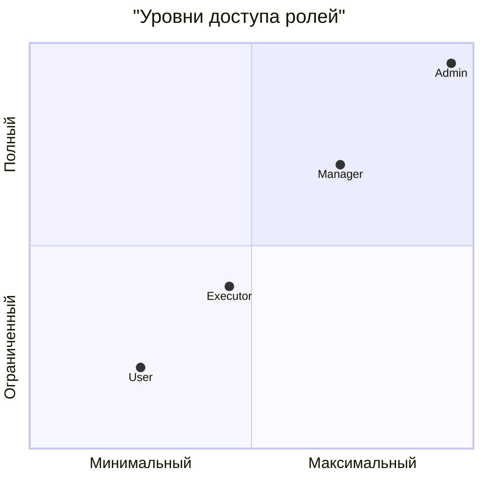

| Роль | Описание | Основные права |
|------|----------|----------------|
| **User** | Обычный сотрудник | Создание инцидентов, просмотр своих, закрытие решённых |
| **Executor** | Исполнитель (технический специалист) | Работа с инцидентами отдела, взятие в работу, решение |
| **Manager** | Руководитель отдела | Управление инцидентами отдела, назначение исполнителей, статистика |
| **Admin** | Администратор системы | Полный доступ, управление пользователями, настройка системы |

### 1.3. Основные возможности

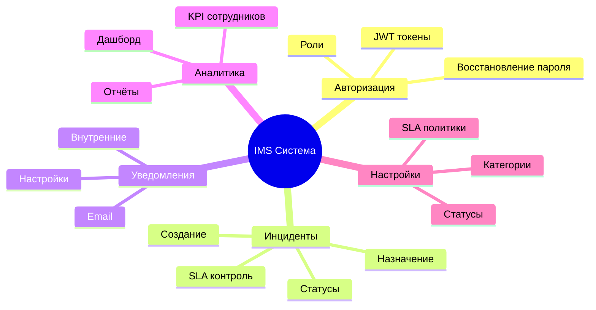

---

## 2. АРХИТЕКТУРА СИСТЕМЫ

### 2.1. Общая архитектура

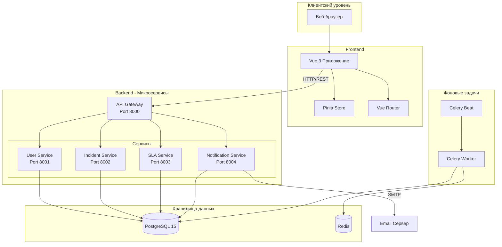

### 2.2. Структура проекта

```
incidents/
├── backend/
│   ├── api-gateway/           # Шлюз маршрутизации запросов
│   │   ├── main.py            # Точка входа
│   │   ├── routers/           # Маршруты API
│   │   └── requirements.txt
│   │
│   ├── services/              # Микросервисы
│   │   ├── user-service/          # Пользователи и авторизация
│   │   ├── incident-service/      # Инциденты и комментарии
│   │   ├── sla-service/           # SLA политики и эскалация
│   │   └── notification-service/  # Уведомления и email
│   │
│   └── shared/                # Общие компоненты
│       ├── database.py        # Подключение к БД
│       ├── models.py          # ORM модели
│       └── celery_app.py      # Celery конфигурация
│
├── frontend/
│   ├── src/
│   │   ├── components/        # Переиспользуемые компоненты
│   │   ├── views/             # Страницы приложения
│   │   ├── router/            # Маршрутизация
│   │   ├── stores/            # Pinia хранилища
│   │   ├── composables/       # Composition API
│   │   └── assets/            # Ресурсы
│   └── package.json
│
├── ЗАПУСК.md                  # Инструкция по запуску
└── ДОКУМЕНТАЦИЯ_СИСТЕМЫ_IMS.md # Этот файл
```

### 2.3. Технологический стек

| Компонент | Технология | Назначение |
|-----------|------------|------------|
| **Frontend** | Vue 3 + Vite | SPA приложение |
| **UI Framework** | Tailwind CSS | Стилизация |
| **State Management** | Pinia | Глобальное состояние |
| **HTTP Client** | Axios | API запросы |
| **Charts** | Chart.js | Визуализация данных |
| **Backend** | Python 3.11 + FastAPI | REST API |
| **ORM** | SQLAlchemy 2.0 | Работа с БД |
| **Database** | PostgreSQL 15 | Основное хранилище |
| **Cache/Queue** | Redis | Кэш и очередь задач |
| **Task Queue** | Celery | Фоновые задачи |
| **Auth** | JWT (python-jose) | Аутентификация |
| **Password** | Passlib (bcrypt) | Хеширование паролей |
| **Email** | SMTP | Отправка уведомлений |

---

## 3. БАЗА ДАННЫХ

### 3.1. ER-диаграмма

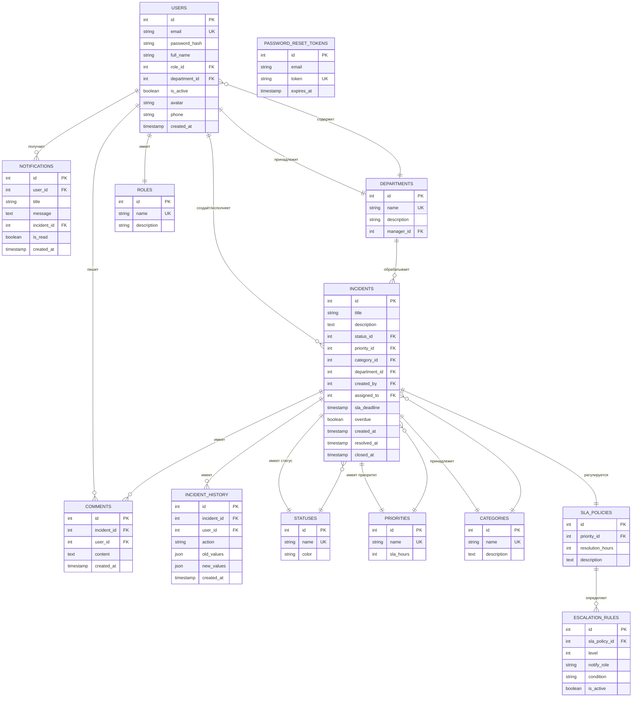

### 3.2. Описание таблиц

#### 3.2.1. users
Пользователи системы

| Поле | Тип | Описание |
|------|-----|----------|
| id | INTEGER | Первичный ключ |
| email | VARCHAR | Уникальный email |
| password_hash | VARCHAR | Хешированный пароль (bcrypt) |
| full_name | VARCHAR | ФИО |
| role_id | INTEGER | Внешний ключ на roles |
| department_id | INTEGER | Внешний ключ на departments |
| is_active | BOOLEAN | Активен/заблокирован |
| avatar | TEXT | Base64 изображение аватара |
| phone | VARCHAR | Телефон |
| created_at | TIMESTAMP | Дата создания |

#### 3.2.2. roles
Роли пользователей

| Поле | Тип | Описание |
|------|-----|----------|
| id | INTEGER | Первичный ключ |
| name | VARCHAR | Название (Admin, Manager, Executor, User) |
| description | TEXT | Описание роли |

#### 3.2.3. departments
Отделы организации

| Поле | Тип | Описание |
|------|-----|----------|
| id | INTEGER | Первичный ключ |
| name | VARCHAR | Название отдела |
| description | TEXT | Описание |
| manager_id | INTEGER | Руководитель (user_id) |

#### 3.2.4. incidents
Инциденты

| Поле | Тип | Описание |
|------|-----|----------|
| id | INTEGER | Первичный ключ |
| title | VARCHAR | Заголовок |
| description | TEXT | Описание |
| status_id | INTEGER | Текущий статус |
| priority_id | INTEGER | Приоритет |
| category_id | INTEGER | Категория |
| department_id | INTEGER | Отдел-исполнитель |
| created_by | INTEGER | Инициатор |
| assigned_to | INTEGER | Исполнитель |
| sla_deadline | TIMESTAMP | Дедлайн по SLA |
| overdue | BOOLEAN | Просрочен |
| created_at | TIMESTAMP | Дата создания |
| assigned_at | TIMESTAMP | Дата назначения |
| taken_at | TIMESTAMP | Дата взятия в работу |
| resolved_at | TIMESTAMP | Дата решения |
| closed_at | TIMESTAMP | Дата закрытия |

#### 3.2.5. incident_history
История изменений инцидентов

| Поле | Тип | Описание |
|------|-----|----------|
| id | INTEGER | Первичный ключ |
| incident_id | INTEGER | Инцидент |
| user_id | INTEGER | Кто изменил |
| action | VARCHAR | Тип действия |
| old_values | JSON | Старые значения |
| new_values | JSON | Новые значения |
| created_at | TIMESTAMP | Дата изменения |

---

## 4. BACKEND СЕРВИСЫ

### 4.1. API Gateway (Port 8000)

**Назначение:** Единая точка входа для всех клиентских запросов, маршрутизация к соответствующим сервисам.

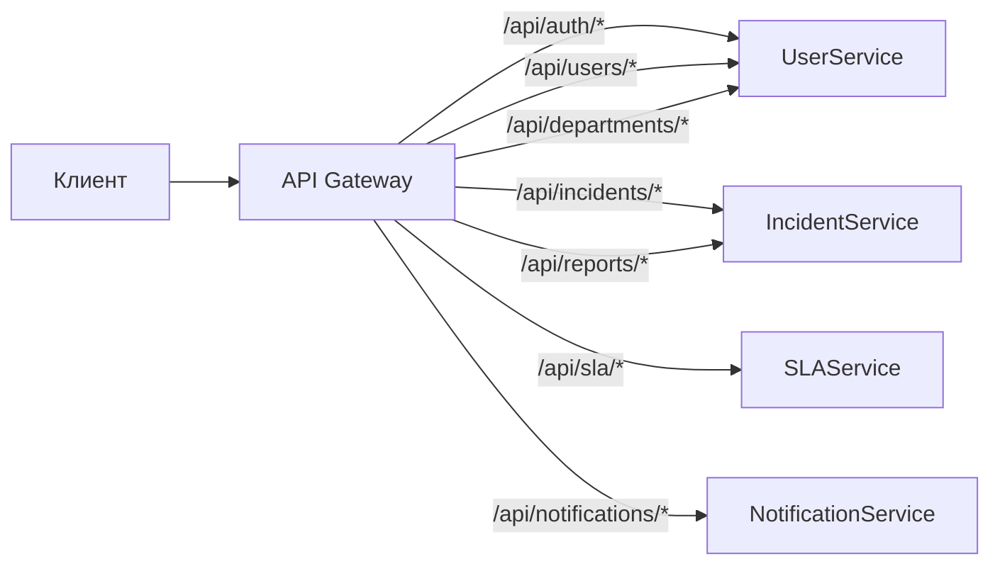

**Основные маршруты:**
- `/api/auth/*` — аутентификация
- `/api/users/*` — пользователи
- `/api/departments/*` — отделы
- `/api/incidents/*` — инциденты
- `/api/sla/*` — SLA политики
- `/api/notifications/*` — уведомления
- `/api/reports/*` — отчёты и статистика

### 4.2. User Service (Port 8001)

**Назначение:** Управление пользователями, ролями, отделами и аутентификацией.

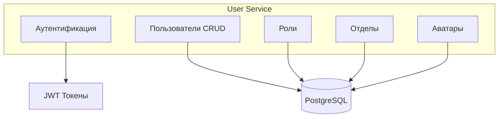

**Функции:**
- Регистрация и вход (JWT)
- Восстановление пароля
- CRUD пользователей
- Управление ролями
- Управление отделами
- Загрузка аватаров

### 4.3. Incident Service (Port 8002)

**Назначение:** Управление инцидентами, комментариями, историей изменений.

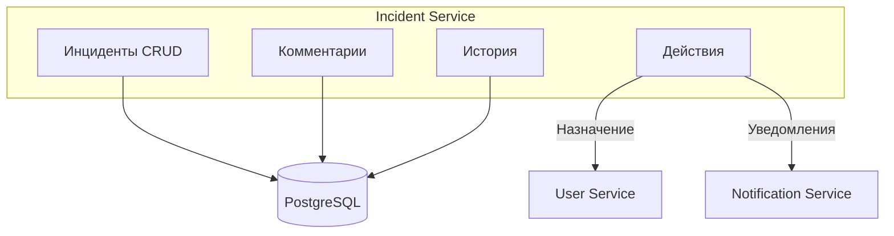

**Функции:**
- CRUD инцидентов
- Назначение исполнителей
- Изменение статусов
- Комментарии
- История изменений
- Отчёты и статистика

### 4.4. SLA Service (Port 8003)

**Назначение:** Управление SLA-политиками, расчёт дедлайнов, эскалация.

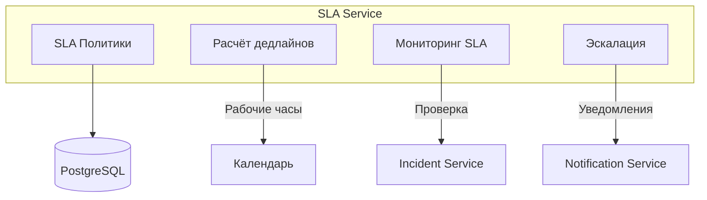

**Функции:**
- CRUD SLA-политик
- Расчёт дедлайнов (рабочие часы 9-18, Пн-Пт)
- Мониторинг просрочек (каждые 5 мин)
- Эскалация по уровням

### 4.5. Notification Service (Port 8004)

**Назначение:** Внутренние уведомления, email-рассылка, настройки уведомлений.

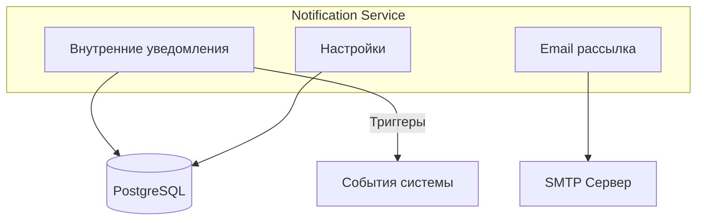

**Функции:**
- Создание внутренних уведомлений
- Отправка email
- Настройки пользователей
- Шаблоны писем

---

## 5. FRONTEND ПРИЛОЖЕНИЕ

### 5.1. Архитектура

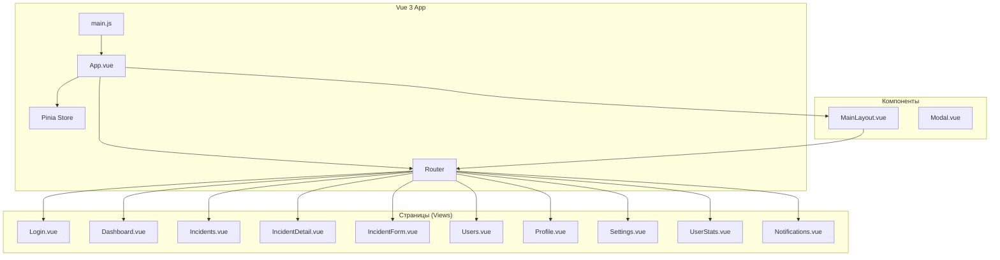

### 5.2. Структура views

| Компонент | Путь | Описание | Роли |
|-----------|------|----------|------|
| Login.vue | /login | Вход в систему | Все |
| Dashboard.vue | /dashboard | Дашборд со статистикой | Manager, Admin |
| Incidents.vue | /incidents | Список инцидентов | Все |
| IncidentForm.vue | /incidents/new | Создание инцидента | Все |
| IncidentDetail.vue | /incidents/:id | Детали инцидента | Все |
| Users.vue | /users | Управление пользователями | Admin |
| Profile.vue | /profile | Профиль пользователя | Все |
| Settings.vue | /settings | Настройки системы | Admin |
| UserStats.vue | /users/:id/stats | Статистика сотрудника | Manager, Admin |
| Departments.vue | /departments | Список отделов | Все |
| Notifications.vue | /notifications | Уведомления | Все |
| ForgotPassword.vue | /forgot-password | Сброс пароля | Все |
| ResetPassword.vue | /reset-password | Установка пароля | Все |
| NotFound.vue | * | Страница 404 | Все |

### 5.3. Маршрутизация и guard'ы

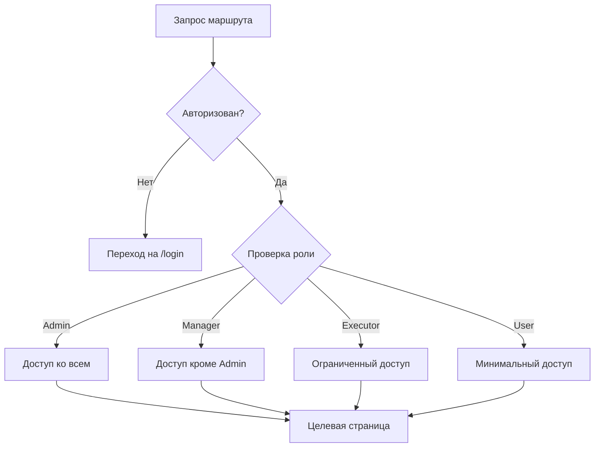

---

## 6. АВТОРИЗАЦИЯ И ПОЛЬЗОВАТЕЛИ

### 6.1. JWT Аутентификация

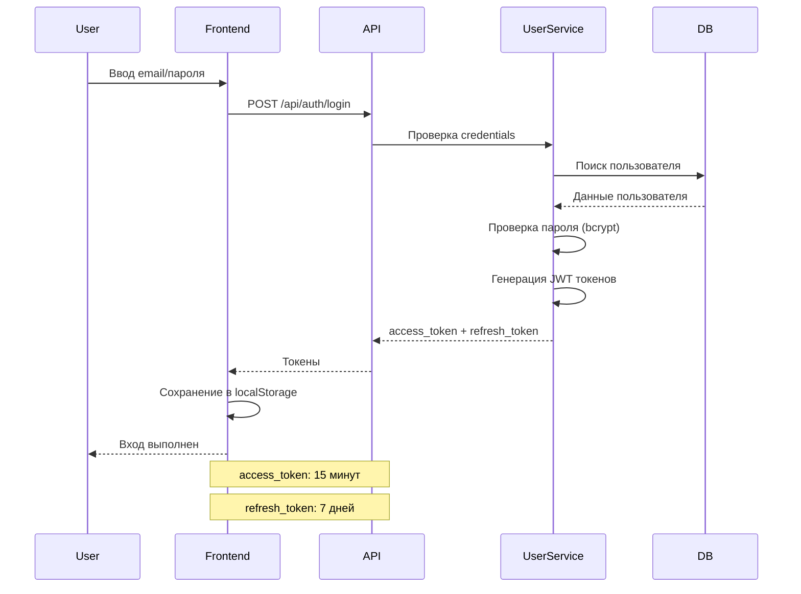

### 6.2. Восстановление пароля

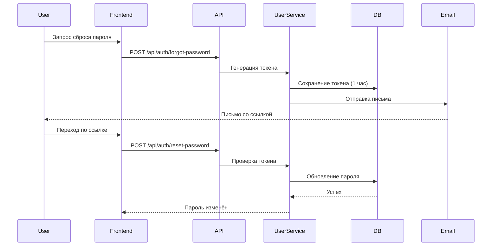

### 6.3. Ролевая модель доступа

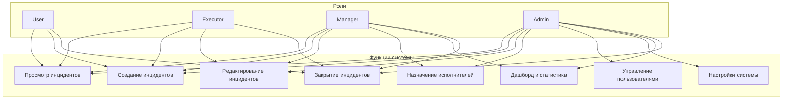

---

## 7. УПРАВЛЕНИЕ ИНЦИДЕНТАМИ

### 7.1. Жизненный цикл инцидента

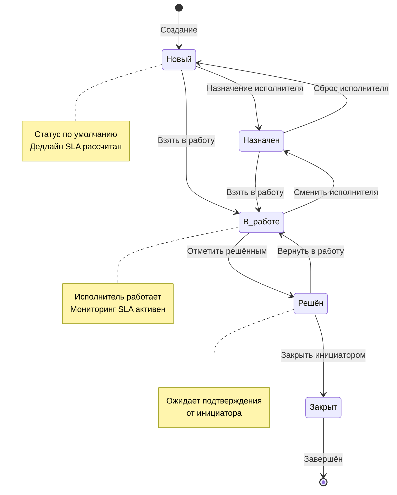

### 7.2. Процесс создания инцидента

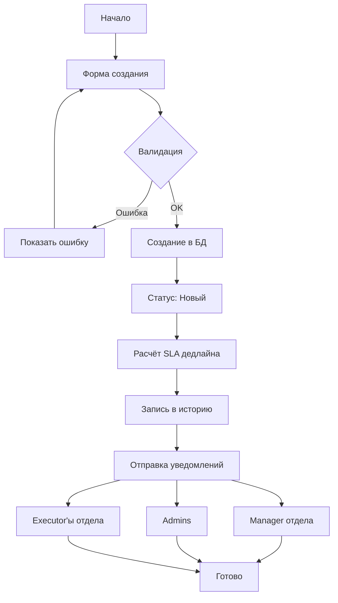

### 7.3. Права видимости инцидентов

| Роль | Видимые инциденты |
|------|-------------------|
| **User** | Только созданные им |
| **Executor** | Своего отдела + созданные им |
| **Manager** | Все своего отдела |
| **Admin** | Все инциденты системы |

### 7.4. Детальная страница инцидента

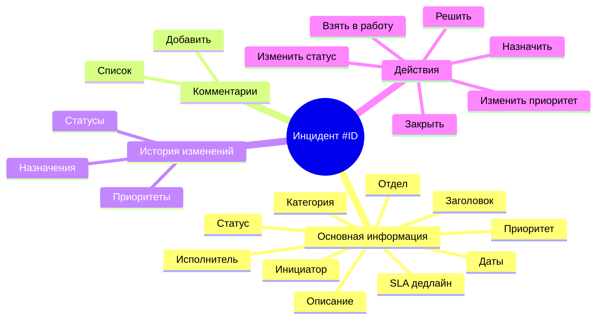

---

## 8. SLA И ЭСКАЛАЦИЯ

### 8.1. SLA-политики по умолчанию

| Приоритет | Время решения |
|-----------|---------------|
| Критический | 4 часа |
| Высокий | 8 часов |
| Средний | 24 часа |
| Низкий | 72 часа |

### 8.2. Расчёт дедлайна

```mermaid
flowchart TD
    Start[Создание инцидента] --> GetPriority[Получить приоритет]
    GetPriority --> GetSLA[Получить SLA часы]
    GetSLA --> CheckTime{Рабочее время?}
    
    CheckTime -->|Нет| SkipToNext[Перенос на начало<br/>след. рабочего дня]
    CheckTime -->|Да| AddHours[Добавить SLA часы]
    
    SkipToNext --> CalcEnd[Расчёт конечной даты]
    AddHours --> CalcEnd
    
    CalcEnd --> CheckWeekend{Выходной?}
    CheckWeekend -->|Да| SkipToNext
    CheckWeekend -->|Нет| Save[Сохранить дедлайн]
    
    note right of Start
        Рабочие часы: 9:00-18:00
        Рабочие дни: Пн-Пт
        Праздники не учитываются
    end note
```

### 8.3. Визуальная индикация SLA

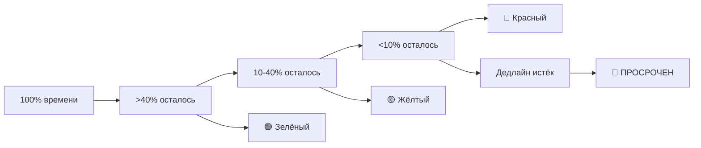

### 8.4. Процесс эскалации

```mermaid
sequenceDiagram
    participant Celery
    participant SLAService
    participant IncidentService
    participant NotifService
    participant DB
    
    Celery->>SLAService: check_sla_overdue каждые 5 мин
    SLAService->>DB: Получить активные инциденты
    DB-->>SLAService: Список инцидентов
    
    loop Для каждого инцидента
        SLAService->>SLAService: Расчёт % использования SLA
        SLAService->>SLAService{Уровень?}
        
        SLAService->>NotifService|80% SLA: Эскалация Уровень 1
        NotifService->>DB: Сохранить уведомление
        NotifService->>Email: Отправить email Manager/Admin
        
        SLAService->>NotifService|overdue: Эскалация Уровень 2
        NotifService->>DB: Критическое уведомление
        NotifService->>Email: Email Admin
    end
```

### 8.5. Уровни эскалации

| Уровень | Условие | Получатели | Критичность |
|---------|---------|------------|-------------|
| **1** | ≥80% SLA использовано | Manager отдела, Admin | Предупреждение |
| **2** | overdue = True | Admin | Критическое |

---

## 9. УВЕДОМЛЕНИЯ

### 9.1. Типы уведомлений

| Тип | Событие | Получатели |
|-----|---------|------------|
| incident_created | Новый инцидент | Manager, Admin, Executor'ы |
| incident_assigned | Назначение исполнителя | Исполнитель |
| status_changed | Изменение статуса | Инициатор, Manager |
| incident_resolved | Инцидент решён | Инициатор, Manager |
| incident_closed | Инцидент закрыт | Исполнитель, Manager |
| new_comment | Новый комментарий | Участники инцидента |
| sla_overdue | Просрочка SLA | Admin, Manager |
| escalation | Эскалация | По правилам эскалации |
| priority_changed | Изменение приоритета | Исполнитель, Manager |
| password_changed | Пароль изменён | Пользователь |

### 9.2. Архитектура уведомлений

```mermaid
flowchart TB
    subgraph "Источники"
        Incident[Инциденты]
        SLA[SLA Service]
        User[Пользователи]
    end
    
    subgraph "Notification Service"
        Queue[Очередь событий]
        Processor[Обработчик]
        Internal[Внутренние]
        Email[Email]
    end
    
    subgraph "Получатели"
        Browser[Веб-интерфейс]
        Mailbox[Email ящик]
    end
    
    Incident --> Queue
    SLA --> Queue
    User --> Queue
    
    Queue --> Processor
    Processor --> Internal
    Processor --> Email
    
    Internal --> Browser
    Email --> Mailbox
```

### 9.3. Настройки уведомлений

Пользователи могут настраивать получение уведомлений для каждого типа:

```mermaid
graph TD
    Settings[Настройки уведомлений]
    
    Settings --> IC[incident_created]
    Settings --> IA[incident_assigned]
    Settings --> SC[status_changed]
    Settings --> IR[incident_resolved]
    Settings --> IC2[incident_closed]
    Settings --> NC[new_comment]
    Settings --> SO[sla_overdue]
    Settings --> ESC[escalation]
    Settings --> PC[priority_changed]
    
    IC --> Int1[В системе]
    IC --> Email1[Email]
    
    IA --> Int2[В системе]
    IA --> Email2[Email]
    
    style Int1 fill:#90EE90
    style Email1 fill:#FFB6C1
    style Int2 fill:#90EE90
    style Email2 fill:#90EE90
```

---

## 10. ДАШБОРД И СТАТИСТИКА

### 10.1. Дашборд (Manager, Admin)

```mermaid
mindmap
  root((Дашборд))
    Фильтры
      Период
      Отдел
    Метрики
      Всего
      Новые
      В работе
      Решённые
      Просроченные
    Графики
      SLA статистика
      По статусам
      Активность 14 дней
      Топ исполнителей
    Детализация
      По исполнителям
      По отделам
      SLA аналитика
      Просроченные
```

### 10.2. SLA-статистика (круговая диаграмма)

```mermaid
pie
    title "Соблюдение SLA"
    "Соблюдён" : 75
    "Близко к дедлайну" : 15
    "Просрочен" : 10
```

### 10.3. Статистика пользователя

**Доступ:** `/users/:id/stats`

**Метрики:**
- Назначено инцидентов
- Решено инцидентов
- В работе
- Просрочено
- Среднее время решения
- % соблюдения SLA

**Графики:**
- Активность по дням
- Распределение по статусам
- Топ категорий

---

## 11. НАСТРОЙКИ СИСТЕМЫ

### 11.1. Управление статусами (Admin)

```mermaid
flowchart LR
    Admin[Admin] --> List[Список статусов]
    List --> Add[Добавить]
    List --> Edit[Редактировать]
    List --> Delete[Удалить]
    
    Add --> Name[Название]
    Add --> Color[Цвет]
    
    Edit --> Name
    Edit --> Color
    
    Name --> Save[Сохранить в БД]
    Color --> Save
```

**Статусы по умолчанию:**
- Новый (синий)
- Назначен (фиолетовый)
- В работе (жёлтый)
- Решён (зелёный)
- Закрыт (серый)

### 11.2. Управление категориями (Admin)

**Категории по умолчанию:**
- Сеть
- Оборудование
- ПО
- Доступ
- Прочее

### 11.3. SLA-политики (Admin)

| Приоритет | Время (часы) |
|-----------|--------------|
| Критический | 4 |
| Высокий | 8 |
| Средний | 24 |
| Низкий | 72 |

---

## 12. API REFERENCE

### 12.1. Аутентификация

| Метод | Endpoint | Описание |
|-------|----------|----------|
| POST | `/api/auth/login` | Вход (email, password) |
| POST | `/api/auth/logout` | Выход |
| POST | `/api/auth/refresh` | Обновление токена |
| GET | `/api/auth/me` | Текущий пользователь |
| PUT | `/api/auth/password` | Смена пароля |
| POST | `/api/auth/forgot-password` | Запрос сброса |
| POST | `/api/auth/reset-password` | Сброс по токену |

### 12.2. Пользователи

| Метод | Endpoint | Описание |
|-------|----------|----------|
| GET | `/api/users` | Список пользователей |
| GET | `/api/users/{id}` | Получение пользователя |
| POST | `/api/users` | Создание |
| PUT | `/api/users/{id}` | Обновление |
| DELETE | `/api/users/{id}` | Удаление |
| PATCH | `/api/users/{id}/active` | Блокировка/активация |
| POST | `/api/users/{id}/avatar` | Загрузка аватара |

### 12.3. Инциденты

| Метод | Endpoint | Описание |
|-------|----------|----------|
| GET | `/api/incidents` | Список с фильтрами |
| GET | `/api/incidents/{id}` | Получение |
| POST | `/api/incidents` | Создание |
| POST | `/api/incidents/{id}/take` | Взять в работу |
| POST | `/api/incidents/{id}/assign` | Назначить исполнителя |
| POST | `/api/incidents/{id}/resolve` | Отметить решённым |
| POST | `/api/incidents/{id}/close` | Закрыть |
| POST | `/api/incidents/{id}/status` | Изменить статус |
| POST | `/api/incidents/{id}/priority` | Изменить приоритет |
| GET | `/api/incidents/{id}/history` | История изменений |

### 12.4. Комментарии

| Метод | Endpoint | Описание |
|-------|----------|----------|
| GET | `/api/incidents/{id}/comments` | Список |
| POST | `/api/incidents/{id}/comments` | Добавление |

### 12.5. Отчёты

| Метод | Endpoint | Описание |
|-------|----------|----------|
| GET | `/api/reports/dashboard` | Данные дашборда |
| GET | `/api/reports/sla-stats` | SLA статистика |
| GET | `/api/reports/status-stats` | По статусам |
| GET | `/api/reports/activity` | Активность |
| GET | `/api/reports/executors` | Топ исполнителей |
| GET | `/api/reports/executors-detailed` | Детализация |
| GET | `/api/reports/departments` | По отделам |
| GET | `/api/reports/sla-analytics` | SLA аналитика |
| GET | `/api/reports/overdue-incidents` | Просроченные |

---

## 13. БИЗНЕС-ПРОЦЕССЫ

### 13.1. Полный процесс обработки инцидента

```mermaid
flowchart TD
    Start[Создание инцидента] --> Notify1[Уведомление Manager/Admin]
    Notify1 --> Assign{Назначен?}
    
    Assign -->|Нет| Wait1[Ожидание]
    Wait1 --> Escalate1{80% SLA?}
    Escalate1 -->|Да| Esc1[Эскалация Ур.1]
    Esc1 --> Wait1
    
    Assign -->|Да| Take[Взять в работу]
    Take --> Work[Работа над решением]
    Work --> Escalate2{Просрочен?}
    
    Escalate2 -->|Да| Esc2[Эскалация Ур.2]
    Escalate2 -->|Нет| Resolve[Решить]
    
    Esc2 --> Resolve
    Resolve --> Notify2[Уведомление инициатора]
    Notify2 --> Close{Закрыт?}
    
    Close -->|Нет| Return[Вернуть в работу]
    Return --> Work
    
    Close -->|Да| Done[Завершено]
    Done --> Archive[Архивация]
```

### 13.2. Процесс эскалации

```mermaid
flowchart TD
    Start[Мониторинг SLA<br/>каждые 5 мин] --> Check{Активные<br/>инциденты}
    
    Check --> Calc[Расчёт % SLA]
    Calc --> Level{Уровень?}
    
    Level -->|80%+| L1[Уровень 1]
    Level -->|overdue| L2[Уровень 2]
    Level -->|<80%| OK[OK]
    
    L1 --> Notif1[Уведомление<br/>Manager + Admin]
    L2 --> Notif2[Критическое<br/>Admin]
    
    Notif1 --> Log1[Запись в лог]
    Notif2 --> Log2[Запись в лог]
    
    OK --> End[Продолжить мониторинг]
    Log1 --> End
    Log2 --> End
```

### 13.3. Процесс восстановления пароля

```mermaid
flowchart TD
    User[Пользователь] --> Request[Запрос сброса]
    Request --> Generate[Генерация токена]
    Generate --> Save[Сохранение в БД<br/>1 час]
    Save --> Send[Отправка email]
    Send --> Wait[Ожидание]
    
    Wait --> Click{Перешёл по<br/>ссылке?}
    Click -->|Нет| Expire[Истёк через 1 час]
    Click -->|Да| Form[Форма нового пароля]
    
    Form --> Validate{Валидация}
    Validate -->|Ошибка| Form
    Validate -->|OK| Update[Обновление пароля]
    Update --> Delete[Удаление токена]
    Delete --> Notify[Уведомление об<br/>изменении]
    Notify --> Done[Готово]
```

---

## ПРИЛОЖЕНИЕ A. ЦВЕТОВАЯ СХЕМА

| Элемент | Цвет | Hex |
|---------|------|-----|
| **Приоритеты** | | |
| Критический | Красный | `#EF4444` |
| Высокий | Оранжевый | `#F97316` |
| Средний | Синий | `#3B82F6` |
| Низкий | Серый | `#6B7280` |
| **Статусы** | | |
| Новый | Синий | `#3B82F6` |
| Назначен | Фиолетовый | `#8B5CF6` |
| В работе | Жёлтый | `#EAB308` |
| Решён | Зелёный | `#22C55E` |
| Закрыт | Серый | `#6B7280` |
| **SLA** | | |
| >40% времени | Зелёный | `#22C55E` |
| 10-40% | Жёлтый | `#EAB308` |
| <10% | Красный | `#EF4444` |
| Просрочен | Тёмно-красный | `#DC2626` |

---

## ПРИЛОЖЕНИЕ B. ШАБЛОНЫ EMAIL

### B.1. Новый инцидент
```
Тема: Новый инцидент #{{id}} - {{title}}

Здравствуйте, {{recipient_name}}!

Создан новый инцидент:
№: {{id}}
Заголовок: {{title}}
Приоритет: {{priority}}
Отдел: {{department}}
Инициатор: {{initiator}}

Ссылка: {{incident_url}}
```

### B.2. Просрочка SLA
```
Тема: 🔴 ПРОСРОЧКА SLA - Инцидент #{{id}}

ВНИМАНИЕ!

Инцидент #{{id}} "{{title}}" просрочен!

Дедлайн: {{deadline}}
Текущее время: {{current_time}}
Исполнитель: {{executor}}

Требуется немедленное вмешательство!
```

---

**Документ создан:** 2025  
**Актуализирован:** 2025
